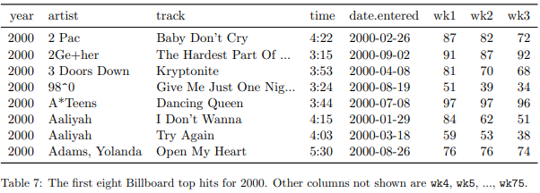
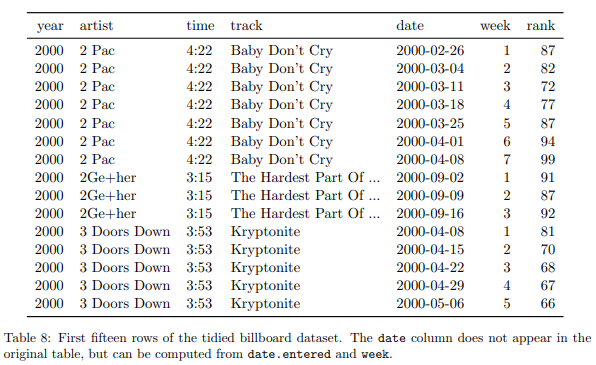

```{r setup, include=FALSE}
knitr::opts_chunk$set(echo = TRUE)
```

Tour of R project:
 
- So far, just a file with a .Rproj extension.  This file indicates "home base" for this project - the root directory.  
- If we move this project directory somewhere else on our hard drive, that .Rproj goes with it.  
- We can use that to our advantage to ensure all file paths are coded relative to that file.
- The alternative (absolute file paths) tend to point to your specific computer's name and directory system, which will not match anyone else's.

Tour of R Markdown:

- Markdown chunks: 
    - easily format text using shortcuts to HTML tags.
    - These chunks are useful to write notes, comments, and explanations about what you are intending to do with your code.  
- code chunks:
    - shaded differently for ease of spotting them
    - start with a "fence" - three backticks, then a curly-brace header with info about the chunk, including language, label, and chunk options.
    - write all your R code - objects will stay in memory even if you leave this chunk and go to another.
    - end with another fence.
    - can type manually, or shortcuts or menu.

Let's load some packages!  Note: not a bad idea to do in setup chunk, but make sure to set up code chunk headers correctly!

```{r load packages}
library(tidyverse) 
  ### dialect of R - cleans up and standardizes a lot of wrangling and data vis.
  ### note the packages listed in the message!

library(here) ### helps with creating relative pathways relative to .Rproj
library(palmerpenguins) ### some data we'll explore
library(poLCA) ### LCA package with some more data we'll use

### NOTE: loading this order, see the message/warning about dplyr::select!
```

At this point, knit the document to create a .html - note the warnings and errors - go back and adjust the setup chunk to avoid this.

## Tidyverse overview

### what is `tidyverse`?
The `tidyverse` package is a metapackage containing multiple other packages that have various uses for data wrangling, analysis, and visualization.  The main ones we care about are:

- `readr` - fast and efficient reading in of data from CSVs and other tabular formats
- `dplyr` - managing, modifying, and working with data frames - 95% of our data wrangling toolbox
- `tidyr` - swapping between tabular formats - wide vs. long
- `ggplot2` - data visualization
- `forcats` - working with categorical variables in dataframes

Others you may be interested in:

- `stringr` - working with string/character data
- `purrr` - iteration
- `lubridate` - working with date formatted data
- `tidymodels` - consistent modeling across multiple model types

Base R is totally fine too, but the syntax is often idiosyncratic and/or hard to interpret.  The `tidyverse` packages were designed to smooth out inconsistencies, improve readability, and in many cases boost performance.  A good data scientist would want to be proficient in both dialects (and maybe `data.table`) as well as other languages.

### Tidy data principles

- Each variable forms a column.
- Each observation forms a row.
- Each type of observational unit forms a table

counter examples:

- Column headers are values, not variable names.
- Multiple variables are stored in one column.
- Variables are stored in both rows and columns.
- Multiple types of observational units are stored in the same table.
- A single observational unit is stored in multiple tables.





### Tidy wrangling in R

- Dataframe as main data type - columns are vectors of a particular class
- `mutate`, `filter`, `select`, `group_by`/`summarize` are the key dplyr functions in a data wrangling workflow
- Pipe operator `%>%` (or `|>` now native to R) for communicating flow - also vertical organization, spacing, etc to make it easy to read
- `pivot_wider` and `pivot_longer` (older: `spread` and `gather`) are key `tidyr` functions to go from wide to long and back, depending on needs of a modeling function

## Enough chitchat, let's get to it

Several use cases to explore, focusing on working with discrete variables:

- continuous variable but want to turn it into discrete, e.g., binning income levels
    - binary vs. nominal vs. ordinal (or dichotomous vs. polytomous)
    - `ntile()`, `ifelse()`, and `case_when()`
- multi-value discretes as factors - ordered or unordered
- spreading multi-valued discretes into multiple dummies

Here we will:

- Load a dataset built into an R package and inspect it
- Convert some columns into categoricals
- Run a simple linear regression to see how R handles categoricals

```{r}
penguins <- palmerpenguins::penguins ### NOT normal way to load data - usually reading in a CSV

summary(penguins)
glimpse(penguins)
head(penguins)

### Create three categorical columns from existing numerics
peng_cats <- penguins %>%
  drop_na() %>%
  rename(bl = bill_length_mm, bd = bill_depth_mm, fl = flipper_length_mm, bm = body_mass_g) %>%
  mutate(bl_cat = ifelse(bl > 43.92, 'long', 'short')) %>%
  # mutate(bl_cat = ifelse(bl > mean(bl, na.rm = TRUE), 'long', 'short')) %>%
  mutate(bd_cat = case_when(bd < 15.6 ~ 'shallow',
                            bd > 18.7 ~ 'deep',
                            TRUE ~ 'medium')) %>%
  mutate(fl_quartile = ntile(fl, 4),          ### careful of handling NAs!
         fl_quartile = factor(fl_quartile))   ### convert numeric to factor (or character?)
peng_lm <- lm(bm ~ bl + bd_cat + fl_quartile + species, data = peng_cats)

summary(peng_lm) ### note reference values and effect of nonref values
```

How to interpret those coefficients?  (all stats sig, p < .05)

- effect of bill length on mass?
- effect of bill depth category? what is the reference value and why?
- effect of flipper length quartile?  ref value and why?
- effect of species? ref value and why?

In this case, the `lm()` function takes a categorical variable, assigns one value as dummy (first level if factor OR first alphabetically if character), then auto creates dummies (T/F or 1/0 for each other level/value).

### What if our modeling function required all dummy vars?

We can spread the various values of flipper length quartile (or bill depth category) into individual columns.  This might be more common for variables with multiple, non-mutually-exclusive values (e.g., `diet` may include instances of vegetables, legumes, dairy, each of which might need to be split into a separate column of T/F)

```{r}
peng_cats2 <- peng_cats %>%
  mutate(bd_val = TRUE) %>%
  ### try this first, note bd_val is consumed; and ask how to improve:
  # pivot_wider(names_from = bd_cat, values_from = bd_val)
  pivot_wider(names_from = bd_cat, values_from = bd_val, 
              values_fill = FALSE, names_prefix = 'bd_') %>%
  ### ask students to do the same with another column -  e.g., species, island, 
  ###   fl_quartile - and maybe use 1/0 or some other fill value
  mutate(fl_val = 1) %>%
  pivot_wider(names_from = fl_quartile, values_from = fl_val,
              values_fill = 0, names_prefix = 'fl_')


```

Note here, each penguin has only one TRUE value across the bd_X columns, since bill depth bins are mutually exclusive.  But if we were studying something like diet, perhaps there would be multiple columns of food items - krill, squid, crab, etc. - potentially with multiple TRUE observations across the various items since they are not mutually exclusive.

Or vice versa, if our data were encoded with a dummy column for each value:

```{r}
peng_cats3 <- peng_cats2 %>%
  mutate(penguin_id = 1:n()) %>% ### create identifier for each penguin observation
  pivot_longer(names_to = 'bd_cat', values_to = 'bd_val', starts_with('bd_')) %>%
  filter(bd_val == TRUE)
```


## Let's try with some new data

Now let's try some wrangling with some data on cheating in high school, built into the `poLCA` package (polytomous latent class analysis).

```{r}
data(cheating) ### or poLCA::cheating

### examine the data in a few ways: summary(), ggplot()

summary(cheating)
glimpse(cheating)
?cheating

cheating <- cheating %>%
  janitor::clean_names()
```

Some things to note:

- the variable names are all shouting!  use janitor::clean_names to tone them down (and eliminate spaces, punctuation, etc) - defaults to snake case.
- the values are all double precision floating point numbers, except GPA which is integer
- all except GPA are scored as 1 (FALSE) or 2 (TRUE)
- GPA is scored as 1 (GPA < 3), 2 (3.00-3.25), 3 (3.26-3.50), 4 (3.51-3.75) and 5 (3.76-4.00).

Thoughts, questions?

Note: leaving as numbers, they will probably not be accurately interpreted as categorical!  

How should we recode the `lieexam`, `liepaper`, `fraud`, and `copyexam` variables?  Discuss pros and cons, then everyone recode according to your preference (or mix-and-match!)

How should we recode the GPA?   multi-value discrete, or multiple columns of binary?  Discuss pros and cons, then everyone recode according to your preference.

## Working with factors in R

So far, we're not explicitly working with factors, though the categorical values in the penguins dataframe are built-in as factors.  Let's use the `poLCA::cheaters` dataframe to work with factors a bit more.

- recode binary to TRUE/FALSE, recode GPA to 'c', 'bminus', 'b', 'bplus', 'a'
- ggplot a bar chart of grades - note anything weird?

```{r}

cheat_recode <- cheating %>%
  mutate(lieexam_lgl  = ifelse(lieexam == 1, FALSE, TRUE),
         liepaper_lgl = (liepaper == 2),
         fraud_lgl    = (fraud == 2),
         copyexam_lgl = case_when(copyexam == 1 ~ FALSE,
                                  copyexam == 2 ~ TRUE,
                                  TRUE          ~ NA) ) %>%
  mutate(gpa_cat = case_when(gpa == 1 ~ 'c',
                             gpa == 2 ~ 'bminus',
                             gpa == 3 ~ 'b',
                             gpa == 4 ~ 'bplus',
                             gpa == 5 ~ 'a',
                             TRUE     ~ NA_character_))


### see across() for applying mutate across multiple columns simultaneously!
### also take advantage of indexes to assign values from a vector
gpa_lvls <- c('c', 'bminus', 'b', 'bplus', 'a') ### leave out missing?

cheat_recode2 <- cheating %>%
  mutate(across(.cols = where(is.double), .fns = ~(.x == 2), .names = '{.col}_lgl')) %>%
  mutate(gpa_chr = gpa_lvls[gpa])


ggplot(cheat_recode2) +
  geom_bar(aes(x = gpa_chr), fill = 'slateblue', color = 'darkblue') +
  theme_minimal() +
  labs(x = 'GPA')
  
```

Using factors, we can turn the gpa_cat column from character to a factor and control the order on the plot, but ALSO the order in which a model function (e.g., `lm()` and probably LCA and MPlus modeling functions) interprets the levels!

```{r}
glimpse(cheat_recode2)

cheat_fct <- cheat_recode2 %>%
  mutate(gpa_fct = factor(gpa_chr, levels = gpa_lvls)) %>%
  mutate(gpa_ord = factor(gpa_chr, levels = rev(gpa_lvls), ordered = TRUE)) %>%
  mutate(gpa_fct2 = forcats::fct_reorder(gpa_chr, gpa))

### use indices to assign values

glimpse(cheat_fct)
head(cheat_fct$gpa_chr)
head(cheat_fct$gpa_fct)
head(cheat_fct$gpa_ord)
```

## Some more data visualization fun with ggplot!

## Tidy up and write out a cleaned/prepped dataset

Let's clean up one of our cheating datasets with logical and factor values, then write it out for use in another script that will ingest the data for modeling.  Note, depending on how we loaded the packages, we might get an error, oh noes!

```{r}
cheat_fct_clean <- cheat_fct %>%
  # select(gpa, gpa_fct, lieexam_cat, ends_with('_lgl')) ### error! check ?select
  dplyr::select(gpa, gpa_fct, lieexam = lieexam_lgl, ends_with('_lgl')) %>%
    ### or load tidyverse after poLCA!
  rename(liepaper = liepaper_lgl, fraud = fraud_lgl, copyexam = copyexam_lgl)
  
### create a data folder, then save out our clean dataframe
write_csv(cheat_fct_clean, here('data', 'cheating_data_cleaned.csv'))

```

Now read in the cleaned data - what do you note about our factor column?  it's just a character column again!  R doesn't store the "factorness" of the column in the saved file.  Discuss, how to turn it back into a factor again, with levels in the right order?  Try it and see what you can figure out.

```{r}
cheat_clean <- read_csv(here('data/cheating_data_cleaned.csv')) 
glimpse(cheat_clean)

cheat_clean <- cheat_clean %>%
  mutate(gpa_fct = fct_reorder(gpa_fct, gpa))
glimpse(cheat_clean)
head(cheat_clean$gpa_fct)
```

